# ASTRA — Quasi-Direct-Drive Spinal Quadruped

**Active Spine Technology for Robotic Agility** — an open-source 9.5 kg quadruped robot with a 3-DoF active spine, built as a B.Sc. thesis at TU München. Designed to be reproducible by hobbyists and labs in the **€2 000 – €3 000** range, with full mechanical CAD, embedded firmware, and ROS 2 control stack.

<p align="center">
  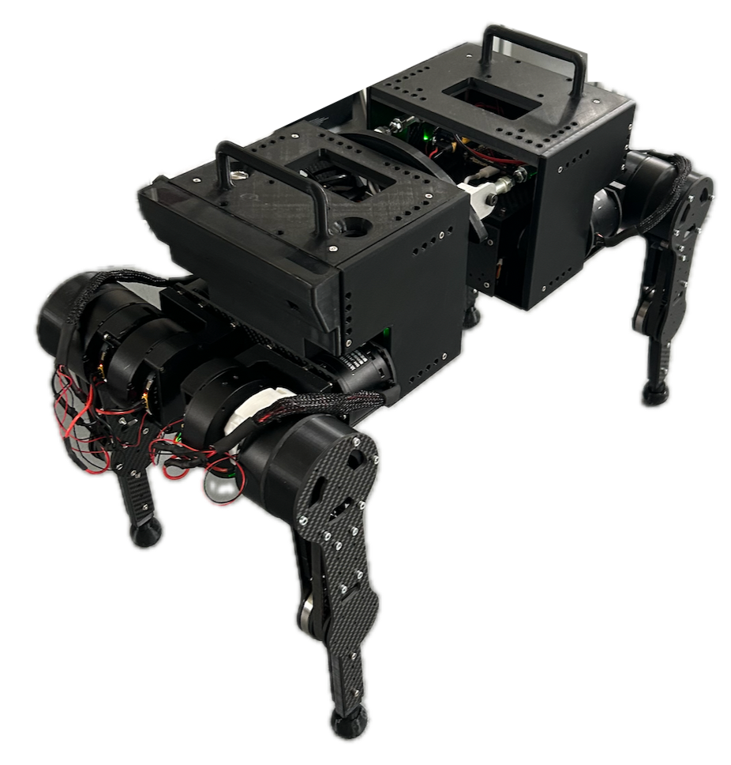
</p>

---

## Why this project

The 2020s have seen quadrupeds like Unitree's **Go2** (~€2 800) and Boston Dynamics' **Spot** (~€75 000) move from labs into the consumer/industrial market. But almost every commercial platform has a **rigid torso**. Biology disagrees: cheetahs, dogs and horses use their spine to extend stride, store elastic energy and rotate the body in flight.

ASTRA is a **research platform built specifically to study active spines**, with a parallel three-DoF spine that can be locked rigid (to baseline against rigid-torso behaviour) or driven actively. The full stack — CAD, firmware, ROS 2 nodes, MuJoCo sim — is released so anyone with a printer, a soldering iron and a €2k budget can rebuild it and run new control algorithms.

<p align="center">
  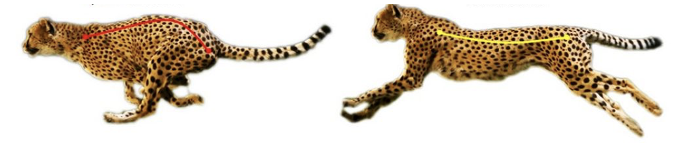
  <br/>
  <em>Biological inspiration: spine flexion/extension in a running cheetah.</em>
</p>

---

## Key specifications

| | ASTRA | MIT Mini Cheetah | ANYmal | Spot |
|---|---|---|---|---|
| **Mass** | **9.5 kg** | 9.0 kg | 50 kg | 32.7 kg |
| **Dimensions (l × w × h)** | **565 × 287 × 435 mm** | 480 × 270 × 300 | 930 × 530 × 890 | 1100 × 500 × 700 |
| **Max speed** | 4 cm/s¹ | 3.9 m/s | 1.3 m/s | 1.6 m/s |
| **Autonomy** | ~25 min | 30–120 min | 90 min | 90 min |
| **Active-spine DoF** | **3** | 0 | 0 | 0 |
| **Total DoF** | 15 (3 × 4 legs + 3 spine) | 12 | 12 | 12 |
| **Estimated build cost** | **~€2.5 k** | — | — | — |

¹ With the current hard-coded open-loop trot. The mechanical platform is designed for >1 m/s once a proper MPC / learned controller is added.

---

## Demos

| Trot on flat ground (real hardware) | Balance on inclined plane |
|---|---|
| 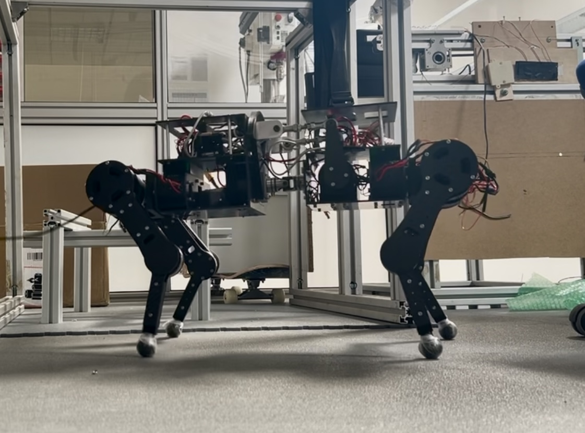 | 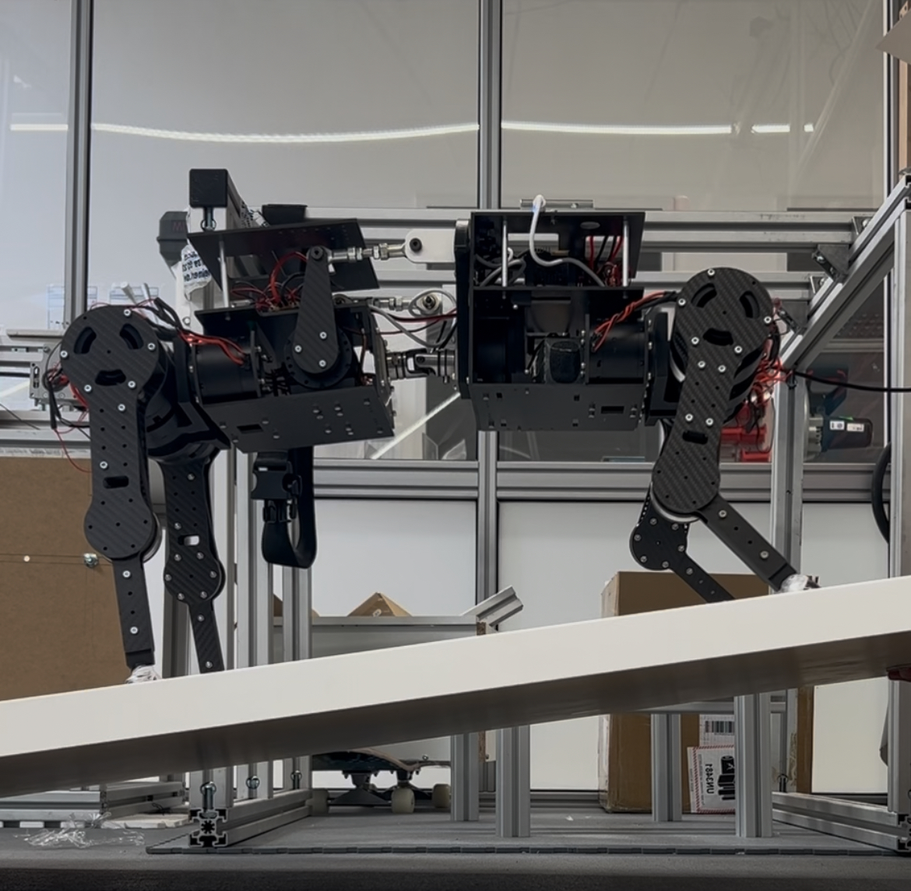 |
| Hard-coded closed-loop quintic foot trajectory, diagonal pairs in phase. | Spine actively rotates to keep one body (front or rear) horizontal. |

Full video clips of both tests live in [`media/`](media/):
- `media/balance_front.mov` — front-body balance on an inclined plane
- `media/balance_rear.mov` — rear-body balance on the same plane
- `media/walk_simulation.mov` — MuJoCo trot

---

## Hardware

### Actuators — quasi-direct drive

| Joint | Motor | Qty | Reduction |
|---|---|---|---|
| Hip & waist (per leg) | Damiao **DM6006** | 8 | direct (1:1) |
| Knee (per leg) | Damiao **DM6006** | 1 + belt | **1.5:1 belt** → QDD |
| Spine (3 DoF) | Damiao **DM4010** | 6 | direct |

15 motors total. All Damiao motors integrate the BLDC driver on-board and expose a **CAN-FD** interface accepting MIT-mode torque control (θ, ω, K<sub>p</sub>, K<sub>d</sub>, τ<sub>ff</sub>). No external ESCs.

### Electronics architecture

<p align="center">
  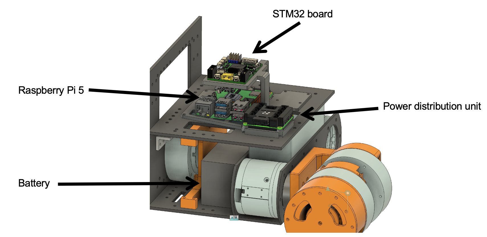
</p>

```
                        ┌─────────────────────────────┐
                        │     Raspberry Pi 5 (brain)  │
                        │     ROS 2 Jazzy, Ubuntu     │
                        └──────┬───────────────┬──────┘
                          USB  │               │  USB
                  ┌────────────▼───┐     ┌─────▼──────────┐
                  │  Front STM32H7 │     │  Rear STM32H7  │
                  │  (CAN bridge)  │     │  (CAN bridge)  │
                  └───┬────────┬───┘     └──┬───┬────┬────┘
                FDCAN1│  FDCAN2│        FDCAN1│ 2 │  3
                  ┌───▼─┐   ┌──▼─┐         ┌──▼┐ │  │
                  │FR M │   │FL M│         │RR M│ │  └─ spine
                  └─────┘   └────┘         └────┘ └─ RL M
```

- **Pi 5** acts as the brain — runs all ROS 2 nodes (non-real-time).
- **2 × STM32H723VG** boards handle the real-time CAN-FD bus (one per body half). Pi → STM32 over USB, STM32 → motors over CAN-FD at 1 Mbit/s arbitration + 5 Mbit/s data.
- **RoboMaster PDU** distributes 24 V from a 6S LiPo battery to the motors; the Pi runs off a separate power bank so a kill-switch can cut motor power without shutting down the controller.

This split lets you swap the Pi for any other host with a USB port — the motor stack stays intact.

### Mechanical design

<p align="center">
  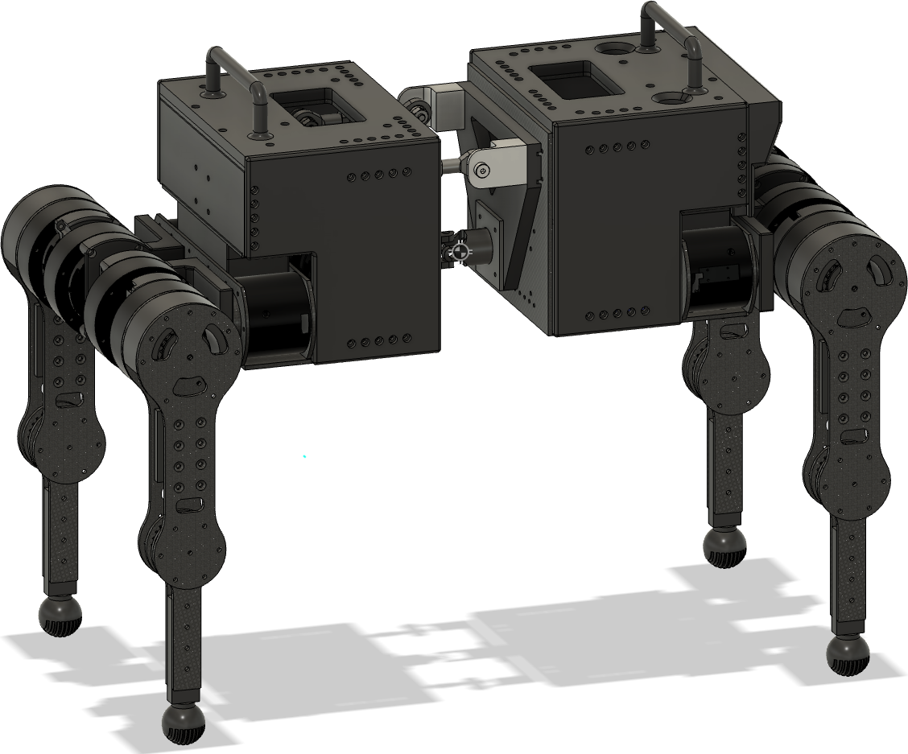
  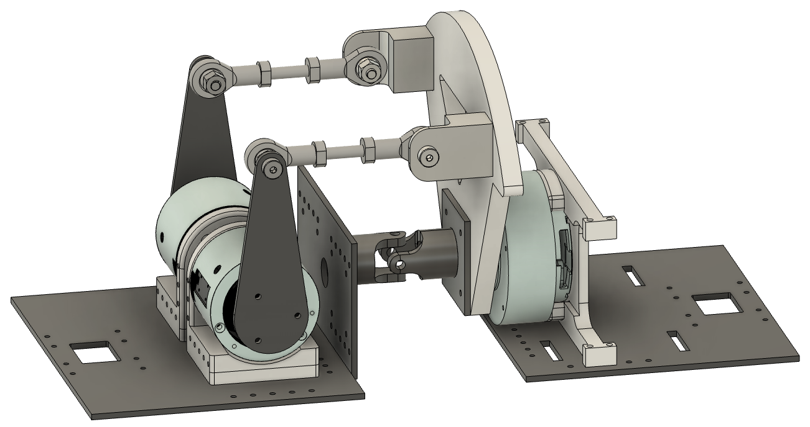
  <br/>
  <em>Left: full body. Right: parallel 3-DoF spine mechanism (pitch, roll, yaw via 2 actuators + universal joint).</em>
</p>

- **CFRP** (carbon-fibre) frame and leg links — light, stiff, cheap to laser-cut.
- **Tough PLA** for the brackets and covers — printable on any consumer FDM printer.
- **Steel** link rods + universal joint for the spine.
- **1.5:1 toothed belt** at the knee for the QDD reduction.

### Mass breakdown

<p align="center">
  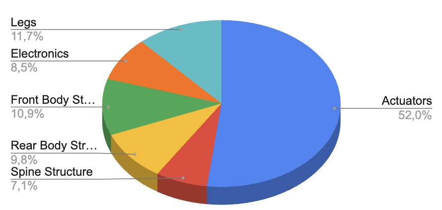
</p>

| Subsystem | Mass [kg] | % of total |
|---|---:|---:|
| Actuators (15 motors) | 4.95 | 52 % |
| Front body structure | 1.04 | 11 % |
| Rear body structure | 0.94 | 10 % |
| Electronics (Pi, STM32, PDU, battery, wiring) | 0.86 | 9 % |
| Spine assembly | 0.67 | 7 % |
| Legs (4 ×) | 1.12 | 12 % |
| **Total** | **9.5** | **100 %** |

---

## Software

### ROS 2 nodes (`ros2_ws/src/`)

| Node | Role |
|---|---|
| `leg_command/` | Low-level motor command publisher. Accepts `"leg,joint,command"` strings and produces the 14-byte USB → CAN-FD frames for any single Damiao motor. Lets you fire one motor at a time from `ros2 topic pub` — invaluable for hardware bring-up. |
| `mujoco_interface/` | Bridges ROS 2 ↔ MuJoCo. Subscribes to `actuator_goal_rad` (15-vector of joint targets) and drives the simulated robot. Publishes a simulated `imu_data` topic. Supports both position and torque (PD) control modes. |
| `hardware_check/` | Boot-time calibration helper. On startup zeroes every motor in MIT mode, then walks through the 5 legs (FR, FL, RR, RL, S) at 5-second intervals so you can hand-position each one at its mechanical zero. |
| `trot/` | Hard-coded trot gait. Computes per-leg foot trajectories from a quintic smoothing function with configurable stride period, duty factor, swing height and phase offsets. Runs IK on each foot target to produce joint goals at 100 Hz, then publishes MIT commands at 33 Hz with a smooth gain ramp. |
| `spine_roll_inclined_plane/` | Inclined-plane balance controller. Reads IMU pitch, then drives the spine and rear legs so that either the **front** or **rear** body stays horizontal — selected by a single flag. |

<p align="center">
  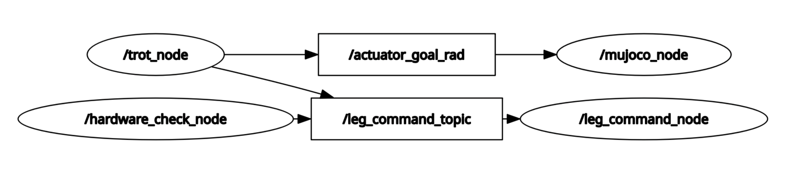
  <br/>
  <em>Live rqt_graph of the running system.</em>
</p>

### STM32 firmware (`firmware/`)

Two STM32CubeIDE projects (`front_stm32/`, `rear_stm32/`) for the **STM32H723VG**:
- 2–3 FDCAN peripherals per board, each connected to one motor bus.
- USB CDC for Pi communication. Every 14-byte USB packet is unpacked into a CAN frame and forwarded.
- Receive interrupt callback re-packages CAN replies (e.g. motor position/velocity feedback) into USB packets for the Pi.

### Simulation (MuJoCo)

A MuJoCo XML model of the full robot lives at `ros2_ws/src/mujoco_interface/model/`. The `mujoco_interface` node runs the physics, exposes the same ROS 2 topics as the real hardware, and lets you bring up any new controller against the simulator first.

<p align="center">
  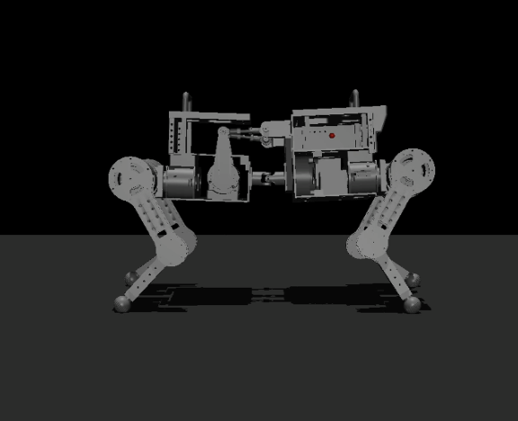
</p>

---

## Joint naming convention

<p align="center">
  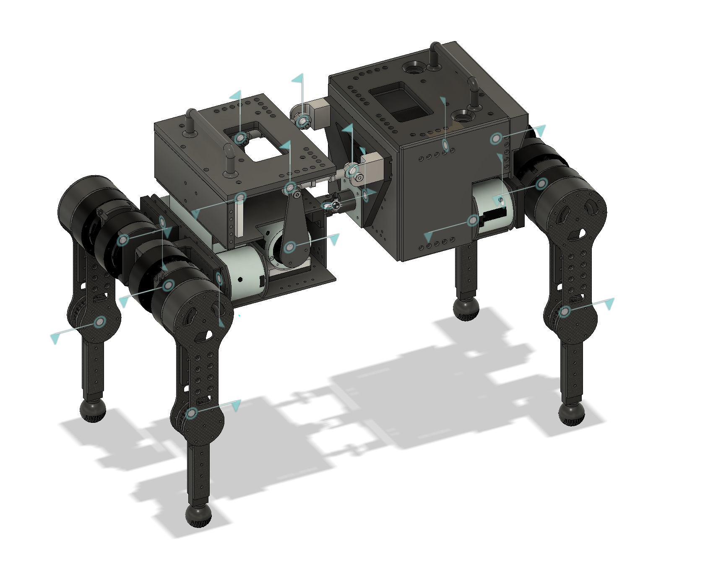
  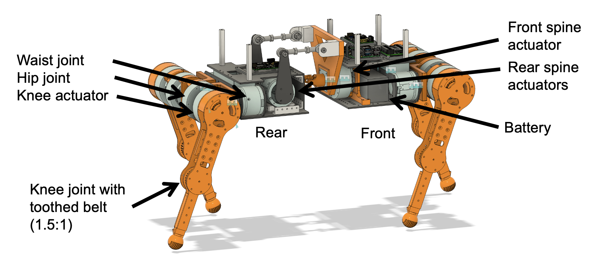
</p>

Legs are indexed **1 = FR, 2 = FL, 3 = RR, 4 = RL**, joints **1 = waist, 2 = hip, 3 = knee**. Spine joints are **1 = front actuator, 2 = rear-left actuator, 3 = rear-right actuator** (treated as "leg 5" in the codebase for uniformity).

---

## CAD

The full mechanical assembly is shared on Fusion 360:

> **Live Fusion 360 model:** https://a360.co/3KbGvEp

A neutral [`cad/ASTRA_quadruped.step`](cad/ASTRA_quadruped.step) (~20 MB) is included for any CAD tool. STL exports for the 3D-printed parts can be generated directly from the STEP/Fusion model.

---

## How to build one

Rough order of operations to reproduce ASTRA:

1. **Order the motors** — 9 × Damiao DM6006 + 6 × Damiao DM4010 (≈ €1 800).
2. **Cut the CFRP frame and leg parts** from the STEP file. A local laser-cutting service is fine.
3. **3D-print the Tough PLA brackets** (see `99_3DPrint` in the thesis appendix for print settings — Bambu Lab P1S / Prusa MK4 both tested).
4. **Wire the electronics**: 1 × Raspberry Pi 5, 2 × STM32H723VG dev boards, 2 × RoboMaster M3508 PDU, 1 × 6S LiPo (~5000 mAh), 1 × IMU.
5. **Flash the firmware**: open `firmware/front_stm32/` and `firmware/rear_stm32/` in STM32CubeIDE and flash each board (set the appropriate STM32 in the IDE — STM32H723VG).
6. **Set up the Pi**: install ROS 2 Jazzy on Ubuntu 24.04, `colcon build` the workspace in `ros2_ws/`.
7. **Bring-up**: launch `hardware_check` to zero every joint, then `mujoco_interface` to verify the model, then `trot` to walk.

Detailed step-by-step is in **Chapter 5** of [the thesis](docs/thesis_ASTRA_quadruped.pdf).

---

## Repo layout

```
spinal-quadruped/
├── README.md
├── LICENSE
├── .gitignore
├── docs/
│   ├── thesis_ASTRA_quadruped.pdf   # Full B.Sc. thesis (62 pages + appendix)
│   └── images/                      # Figures used in this README
├── cad/
│   └── ASTRA_quadruped.step         # Neutral CAD export (20 MB)
├── firmware/
│   ├── front_stm32/                 # STM32CubeIDE project, front body
│   └── rear_stm32/                  # STM32CubeIDE project, rear body
├── ros2_ws/
│   └── src/
│       ├── leg_command/             # Low-level USB→CAN motor publisher
│       ├── mujoco_interface/        # ROS 2 ↔ MuJoCo bridge
│       ├── hardware_check/          # Boot-time joint zero / hold helper
│       ├── trot/                    # Hard-coded trot gait + IK
│       └── spine_roll_inclined_plane/  # Inclined-plane balance controller
└── media/                           # Real-hardware demo videos
```

---

## Author & acknowledgements

**Federico Cominelli** — B.Sc. Mechanical Engineering, TU München, 2025.
[`federico.cominelli@epfl.ch`](mailto:federico.cominelli@epfl.ch)

Supervised by **Mr. Lingchong Gao** (Chair of Materials Handling, Material Flow, Logistics — fml) and **Mr. Liangyu Dong** (Chair of Robotics, AI and Real-time Systems), under **Prof. Dr.-Ing. Johannes Fottner**, TU München School of Engineering and Design.

Submitted September 2025.

---

## License

Released under the **MIT License** — see [LICENSE](LICENSE). The Damiao motor headers and ST CubeMX-generated HAL drivers retain their original licenses. The MuJoCo headers bundled in `ros2_ws/src/mujoco_interface/include/mujoco/` are © Google / DeepMind under the Apache 2.0 license.
